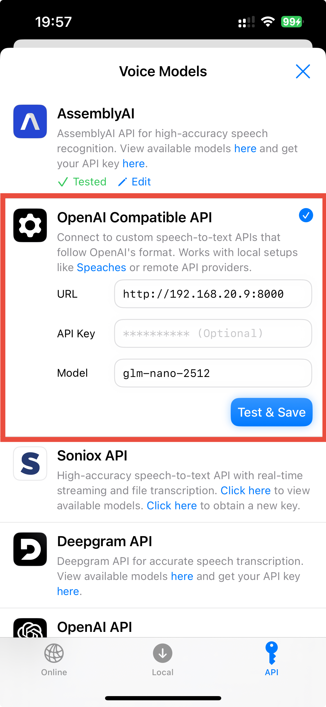

# GLM-ASR

A FastAPI-based speech-to-text service powered by the GLM-ASR-Nano model. Transcribe audio files with ease using this OpenAI-compatible API.

Inspired by the architecture of [faster-whisper-server](https://github.com/fedirz/faster-whisper-server) by Fedir Zadniprovskyi.

## Features

- **OpenAI-compatible API**: Drop-in replacement for OpenAI's audio transcription endpoint
- **Multi-format support**: Handles various audio formats via FFmpeg
- **GPU acceleration**: CUDA support for fast inference
- **Streaming ready**: FastAPI-based architecture for easy extension
- **Docker support**: Production-ready containerized deployment

## Requirements

- Docker

## Run in Docker

```
touch .env
# override env vars in .env, e.g.: PORT=8000
make build
make server
```

## Usage

### Transcribe Audio

```bash
curl -X POST "http://localhost:8000/v1/audio/transcriptions" \
  -H "Content-Type: multipart/form-data" \
  -F "file=@audio.mp3"
```

### List Available Models

```bash
curl "http://localhost:8000/v1/models"
```

Returns:
```json
{
  "data": [
    {
      "id": "glm-nano-2512",
      "object": "model"
    }
  ]
}
```

## API Documentation

Interactive API documentation is available at `http://localhost:8000/docs` when the server is running.

## Frontend Options

For a complete speech-to-text experience, you can use these frontend applications that are compatible with this GLM-ASR server:

- **[NeuralWhisper](https://github.com/lsj5031/NeuralWhisper)** - A modern web-based frontend for speech transcription with real-time capabilities
- **[WhisperSqueak](https://github.com/lsj5031/WhisperSqueak)** - A lightweight desktop application for audio transcription

Both frontends are designed to work seamlessly with this GLM-ASR server's OpenAI-compatible API endpoints.

To use it in Spokenly:




## Model

Uses the [GLM-ASR-Nano-2512](https://huggingface.co/zai-org/GLM-ASR-Nano-2512) model from the [ZAI organization](https://huggingface.co/zai-org), which provides efficient speech recognition with minimal computational overhead.

The GLM-ASR project is developed by the ZAI team and represents state-of-the-art multimodal speech recognition capabilities.

## Performance

- Input audio is resampled to 16kHz (optimal for the model)
- Supports up to 30-second chunks, automatically batched for longer audio
- Inference runs in bfloat16 precision for efficiency

## Acknowledgments

This project builds upon the excellent work of:

- **GLM-ASR** - The underlying speech recognition model by the ZAI organization ([zai-org/GLM-ASR-Nano-2512](https://huggingface.co/zai-org/GLM-ASR-Nano-2512))
- **faster-whisper-server** - Inspired by [Fedir Zadniprovskyi's architecture](https://github.com/fedirz/faster-whisper-server) for OpenAI-compatible speech API servers
- **FastAPI** - For the excellent Python web framework
- **HuggingFace** - For the Transformers library and model hub

## License

MIT License - See LICENSE file for details

## Contributing

Contributions are welcome. Please feel free to submit a pull request.

We especially welcome enhancements to the Dockerfile to make it smaller and more modern. If you have ideas for optimizing the Docker image (multi-stage builds, better layer caching, Alpine Linux compatibility, etc.), we'd love to see your contributions.

## Citation

If you use GLM-ASR in your research, please cite the original GLM-ASR model from ZAI organization:

```bibtex
@misc{glm-asr,
  title={GLM-ASR: Global Large-scale Multimodal Model for Automatic Speech Recognition},
  author={ZAI Organization},
  year={2024},
  url={https://huggingface.co/zai-org}
}
```
